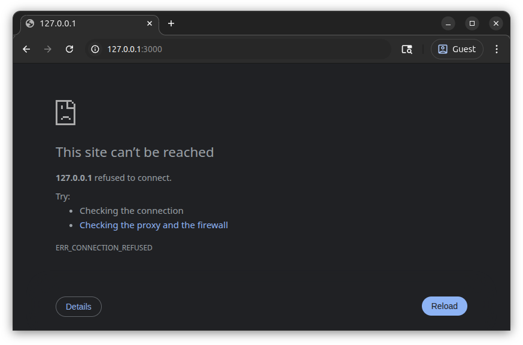
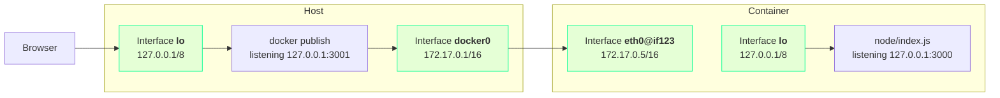
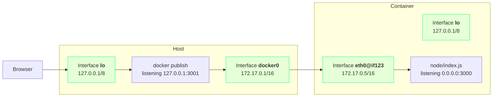
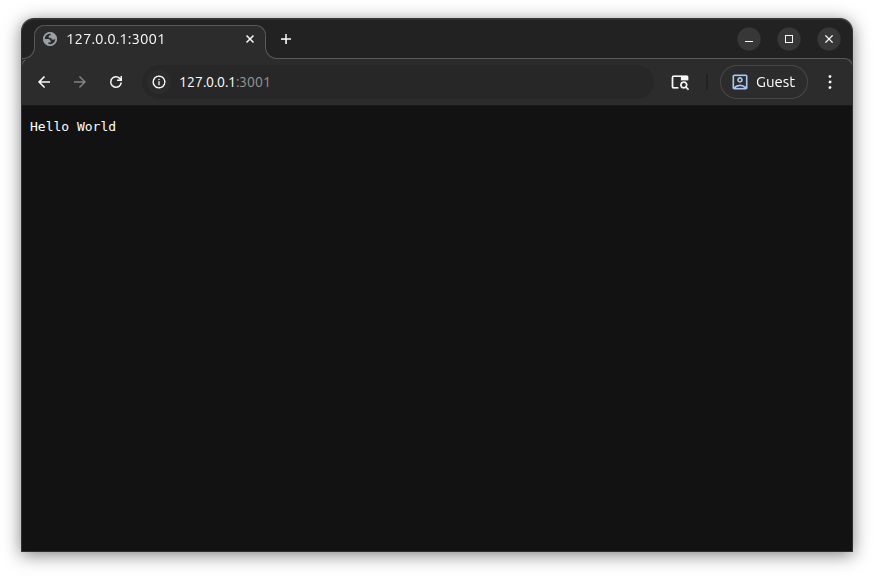

# Hello Docker

This tutorial builds on [Hello World Wide Web](../01-hello-world-wide-web/index.md) to create a container image and run it using docker.

## Install docker

Follow instructions in the [Docker Documentation](https://docs.docker.com/engine/install/ubuntu/#install-using-the-repository)

## Create Dockerfile

The `Dockerfile` contains instructions to build a container image.
The [Dockerfile reference documentation](https://docs.docker.com/reference/dockerfile/) covers many more instructions, but we'll only use a few today.
Create a new file `Dockerfile` in the same directory as `index.js` and paste the following code.

``` Dockerfile {: title=Dockerfile linenums="1" }
--8<-- "docs/kubernetes-walkthrough/02-hello-docker/broken/Dockerfile"
```
{ .annotate }

1. We could use only ```#!Dockerfile FROM node``` which will use the `latest` version of `node`, but this has some problems:
    1. If we try this tutorial a year later, we'd get a very different version of `node` which might act differently.
       Specifying an exact version ensures that it will behave the same as when the tutorial was written.
    2. The [node image on docker hub](https://hub.docker.com/_/node) has multiple variants.
       We're using the `alpine` variant since it's much smaller than the default, so that we don't have to wait as long to build the image.
2. `index.js` is from the previous tutorial [Hello World Wide Web - Add Source](../01-hello-world-wide-web/index.md#add-source)
3. Specifically, the line `#!js const port = 3000;`
4. Just like we did in [Hello World Wide Web - Run the App](../01-hello-world-wide-web/index.md#run-the-app)

## Build Container Image

Run the command below in order to build a container image:

```sh
docker build --tag hello-node .
```

To see the image we created, run:

```sh
docker images hello-node
```

The image shows up in the output:

```text { .no-copy }
IMAGE               ID             DISK USAGE   CONTENT SIZE   EXTRA
hello-node:latest   69436a1c833d        162MB             0B        
```

## Run the Container

Use docker to run a container with the image we built above:

```sh
docker run --rm hello-node
```

!!! abstract "Documentation for `docker run --rm`"

    Automatically remove the container and its associated anonymous volumes when it exits

The output in the terminal shows the app is running:

```text { .no-copy }
Server running at http://127.0.0.1:3000/
```

But, we can't connect using our browser:



We're going to make some changes to fix this, but first we need to stop the running app.

### Stopping the Container

Pressing ++ctrl+c++ `3` times will return to the shell prompt and print:

```text { .no-copy }
got 3 SIGTERM/SIGINTs, forcefully exiting
```

But did it really exit?
Let's use a `docker` command to view running containers:

```sh
docker ps --filter ancestor=hello-node
```

!!! note "`docker ps --filter`"

    This option tells docker to only display containers which meet some criteria.
    In this case, we're telling docker to only show containers which use the `hello-node` image we built above.
    This isn't really required, but avoids displaying any other running containers.

Even though it printed `forcefully exiting`, we see our container with the `hello-node` is still running:

```text { title=Output .no-copy }
CONTAINER ID   IMAGE        COMMAND                  CREATED          STATUS          PORTS      NAMES
2e5e9c9c4253   hello-node   "docker-entrypoint.s…"   18 seconds ago   Up 17 seconds   3000/tcp   friendly_murdock
```

To stop the container, run the command below, replacing `NAME_OR_ID` with either the `CONTAINER ID` or `NAMES` of the container.

```sh
docker kill NAME_OR_ID
```

We don't want to kill the container manually every time we run it, so let's make a small change to how we run it:

```sh
docker run --rm --init hello-node
```

!!! abstract "Documentation for `docker run --init`"

    Run an init inside the container that forwards signals and reaps processes

If we test the new `docker run` command above with `--init`, a single ++ctrl+c++ now exits.
Afterwards, `docker ps` doesn't show any running container with the `hello-node` image.

## Once More, with Forwarding

Now that our app is running inside a container, we can't access it directly anymore.
Fortunately, docker is able to "publish" container ports by forwarding from a port on the host to a port in the container.
To make sure we're communicating with our app running in a container instead of the previous tutorial version, we'll forward a different host port (`3001`) to container port `3000`.

```sh
docker run --rm --init --publish 3001:3000 hello-node
```

If we open <http://127.0.0.1:3001/> in the browser, we still don't see "Hello World", but we do get a different error message:


This means there was something listening on the port, but the connection was closed when the browser tried to write to it.
Because we ran `docker publish`, something is listening now, but the connection is closed because it can't communicate with the container.

To understand why, let's take a deeper look at the container networking.

### Container Networking

Let's run a command in our container to learn more about its network setup.
First, use `docker ps` to get the container's `NAMES`:

```sh
docker ps --filter ancestor=hello-node
```

Now, use `docker exec` to run a command inside the container, replacing `NAME_OR_ID` with either the `CONTAINER ID` or `NAMES` of the container.

```sh
docker exec NAME_OR_ID ip addr list 
```

The command outputs the container's network interfaces:

```text { title=Output .no-copy hl_lines="3 9" }
1: lo: <LOOPBACK,UP,LOWER_UP> mtu 65536 qdisc noqueue state UNKNOWN qlen 1000
    link/loopback 00:00:00:00:00:00 brd 00:00:00:00:00:00
    inet 127.0.0.1/8 scope host lo
       valid_lft forever preferred_lft forever
    inet6 ::1/128 scope host 
       valid_lft forever preferred_lft forever
2: eth0@if123: <BROADCAST,MULTICAST,UP,LOWER_UP,M-DOWN> mtu 1500 qdisc noqueue state UP 
    link/ether 2a:33:63:f3:f1:72 brd ff:ff:ff:ff:ff:ff
    inet 172.17.0.5/16 brd 172.17.255.255 scope global eth0
       valid_lft forever preferred_lft forever
```

Let's also take at the network interfaces on our host machine:

```sh
ip addr list
```

```text { title=Output .no-copy hl_lines="3 10" }
1: lo: <LOOPBACK,UP,LOWER_UP> mtu 65536 qdisc noqueue state UNKNOWN group default qlen 1000
    link/loopback 00:00:00:00:00:00 brd 00:00:00:00:00:00
    inet 127.0.0.1/8 scope host lo
       valid_lft forever preferred_lft forever
    inet6 ::1/128 scope host noprefixroute 
       valid_lft forever preferred_lft forever
...
5: docker0: <BROADCAST,MULTICAST,UP,LOWER_UP> mtu 1500 qdisc noqueue state UP group default 
    link/ether 7e:17:4d:b0:a7:db brd ff:ff:ff:ff:ff:ff
    inet 172.17.0.1/16 brd 172.17.255.255 scope global docker0
       valid_lft forever preferred_lft forever
    inet6 fe80::7c17:4dff:feb0:a7db/64 scope link 
       valid_lft forever preferred_lft forever
```

There are likely other network interfaces in the output, but we can see:

- `lo` - the `localhost` interface for the host.
  While this has the same name as the `lo` interface in the container, they are totally isolated from each other.
- `docker0` - a virtual network interface managed by docker.
  Each container will have a different IP address on this network.

Here's the situation that we're in:



Note that there is no way for the network traffic to move between the container network interfaces `eth0@if123` and `lo`.
This means the traffic never reaches our code in `index.js`.
To fix this, we need to have our code listen on the container `eth0@if123` interface, which has an address such as `172.17.0.5`.

## Listen Everywhere

How do we make this code change?
We can't hardcode the container's network interface address in `index.js` because we won't know it until after the container starts.
Fortunately, there's a standard way to listen on all interfaces, the special address `0.0.0.0`.



Let's update `index.js` to use this address.

``` js {: title=index.js linenums="1" hl_lines="3" }
--8<-- "docs/kubernetes-walkthrough/02-hello-docker/working/index.js"
```

Rebuild the image and start the container again.

```sh
docker build --tag hello-node . && docker run --rm --init --publish 3001:3000 hello-node
```

On startup, we see the new address `0.0.0.0`.

``` {: title=Output .no-copy }
Server running at http://0.0.0.0:3000/
```

Open <http://127.0.0.1:3001/> in the browser again, and we can finally see our **Hello World** greeting!



## Review

That was a lot to do and think about just to get the same functionality as in the previous tutorial.
Why would anyone want to deal with all of this extra complexity?
There are many systems that can start and manage containers.
Any of these could run our container image without needing to know what's inside the container.
Each container could run different code implemented using different programming languages.
