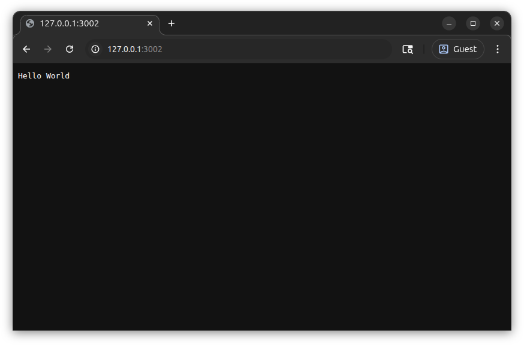

# Hello Kubernetes

This tutorial builds on [Hello Docker](../02-hello-docker/index.md) to run a container image in kubernetes.

## Create Cluster with Kind

Since you probably don't have a spare kubernetes cluster laying around, we'll use [kind](https://kind.sigs.k8s.io/) to create a kubernetes cluster which runs in docker.

### Install Kind

From [Installing From Release Binaries](https://kind.sigs.k8s.io/docs/user/quick-start/#installing-from-release-binaries) in the kind documentation.

```sh
curl -Lo ./kind https://kind.sigs.k8s.io/dl/v0.30.0/kind-linux-amd64
chmod +x ./kind
sudo mv ./kind /usr/local/bin/kind
```

### Create Cluster

Create a `kind` cluster named `tutorial` with kubernetes version `1.34.0`.

```sh
kind create cluster --name tutorial --image kindest/node:v1.34.0
```

## Connect to Cluster

A kubernetes cluster isn't very useful if we don't have a way to interact with it.
The primary tool we'll use is a command line interface called `kubectl`.

### Install Kubectl

From [Kubernetes documentation](https://kubernetes.io/docs/tasks/tools/install-kubectl-linux/#install-using-native-package-management)

```sh
curl -fsSL https://pkgs.k8s.io/core:/stable:/v1.34/deb/Release.key | sudo gpg --dearmor -o /etc/apt/keyrings/kubernetes-apt-keyring.gpg
echo 'deb [signed-by=/etc/apt/keyrings/kubernetes-apt-keyring.gpg] https://pkgs.k8s.io/core:/stable:/v1.34/deb/ /' | sudo tee /etc/apt/sources.list.d/kubernetes.list
sudo chmod 644 /etc/apt/keyrings/kubernetes-apt-keyring.gpg /etc/apt/sources.list.d/kubernetes.list
sudo apt update
sudo apt install kubectl
```

### Get Cluster Version

!!! tip

    If you have multiple clusters, you may want to run this command to make the `kind-tutorial` context active.

    ```sh
    kubectl config use-context kind-tutorial
    ```

```sh
kubectl version
```

```text { title=Output .no-copy }
Client Version: v1.34.2
Kustomize Version: v5.7.1
Server Version: v1.34.0
```

## Create a Pod

Next, we'll create a pod which runs a container, much like we did for [Run the Container](../02-hello-docker/index.md#run-the-container) in docker.

### Create Pod Definition

If you're using Visual Studio Code, the [Kubernetes Extension](https://marketplace.visualstudio.com/items?itemName=ms-kubernetes-tools.vscode-kubernetes-tools) will provide completion and tooltips when creating resources.

Create a new file `hello-node-pod.yaml` and paste the following.

```yaml { title=hello-node-pod.yaml }
--8<-- "docs/kubernetes-walkthrough/03-hello-kubernetes/hello-node-pod.yaml"
```
{ .annotate }

1. `name` can be anything that contains only letters, numbers, and dashes.
   In this tutorial, it's only used in `kubectl` commands.
2. A `pod` can have more than one container, but we only need one in this tutorial.
3. See [Hello Docker](../02-hello-docker/index.md)
4. Don't try to pull the image from a public registry, it doesn't exist there since we built it locally.
5. See the line `#!js const port = 3000;` from [Hello World Wide Web - Add Source](../01-hello-world-wide-web/index.md#add-source)

### Apply Pod Definition

Apply the pod definition to create the pod in the cluster.

```sh
kubectl apply -f hello-node-pod.yaml
```

```text { title=Output .no-copy }
pod/hello-node-pod created
```

### Get Pods

Show all pods to see the one we just created.

```sh
kubectl get pods
```

```text { title=Output .no-copy }
NAME             READY   STATUS              RESTARTS   AGE
hello-node-pod   0/1     ErrImageNeverPull   0          12s
```

Note the `0/1` `READY` status which indicates the pod's container is not starting.

### View Pod Events

Let's take a look at the pod events to see why it's not `READY`.

```sh
kubectl events --for pod/hello-node-pod
```

```text { title=Output .no-copy }
LAST SEEN              TYPE      REASON              OBJECT               MESSAGE
71s                    Normal    Scheduled           Pod/hello-node-pod   Successfully assigned default/hello-node-pod to tutorial-control-plane
10s (x7 over 70s)      Warning   ErrImageNeverPull   Pod/hello-node-pod   Container image "hello-node:1.0.1" is not present with pull policy of Never
10s (x7 over 70s)      Warning   Failed              Pod/hello-node-pod   Error: ErrImageNeverPull
```

The image `hello-node:1.0.1` is not available in the cluster.

### Load image

Run a `kind` command to load the docker image into the kubernetes cluster registry.

```sh
kind load docker-image --name tutorial hello-node:1.0.1
```

```sh
kubectl get pods
```

```text { title=Output .no-copy }
NAME             READY   STATUS    RESTARTS   AGE
hello-node-pod   1/1     Running   0          3m15s
```

## Show Logs

Similar to `docker logs`, we can use `kubectl` to show the pod logs.

```sh
kubectl logs hello-node-pod
```

```text { title=Output .no-copy }
Server running at http://0.0.0.0:3000/
```

## Port Forwarding

We'd like to access the app from a browser.
We'll learn other ways to do this later, but for now we can forward a port on our host to the container.
To make sure we're communicating with our app running in kubernetes instead of the previous tutorial version, we'll forward a different host port (`3002`) to container port `3000`.

```sh
kubectl port-forward pod/hello-node-pod 3002:3000
```

```text { title=Output .no-copy }
Forwarding from 127.0.0.1:3002 -> 3000
Forwarding from [::1]:3002 -> 3000
```

`kubectl port-forward` will keep running to handle connections.
Open <http://127.0.0.1:3002/> in the browser, and we can again see our **Hello World** greeting!



`kubectl port-forward` will also generate some additional output.

```text { title="Output" .no-copy }
Handling connection for 3002
```

Now that we're done testing, press ++ctrl+c++ in your terminal to stop the `kubectl port-forward`.

## Cleanup

Let's clean up the cluster that we created so the container doesn't consume resources.

### Delete Pod

If we're deleting the whole cluster anyways, it's not really necessary to delete the pod first.
However, it's good to know how to delete it just in case.

```sh
kubectl delete -f hello-node-pod.yaml
```

Verify that the pod is gone.

```sh
kubectl get pod
```

This command is going to hang for awhile.
Remember our old nemesis from [Stopping the Container](../02-hello-docker/index.md#stopping-the-container)?
We've got the same problem here, but kubernetes has different default behavior than docker.
It will send `SIGTERM` to ask the container's main process, wait `30` seconds for it to exit, and then send `SIGKILL` which can't be ignored.

```text { title=Output .no-copy }
No resources found in default namespace.
```

### Delete Cluster

While an idle kubernetes node doesn't consume many resources, it still requires some that we can free up by deleting the cluster.
It's easy to recreate if you want to try more experiments.

```sh
kind delete cluster --name tutorial
```

```text { title=Output .no-copy }
Deleting cluster "tutorial" ...
Deleted nodes: ["tutorial-control-plane"]
```

## Review

We were able to start our app in kubernetes, just like we did last time using docker.
However, `docker port-forward` isn't a very friendly way to access the app.
Next time, we'll see more advanced ways to deploy apps and route network traffic in kubernetes.
