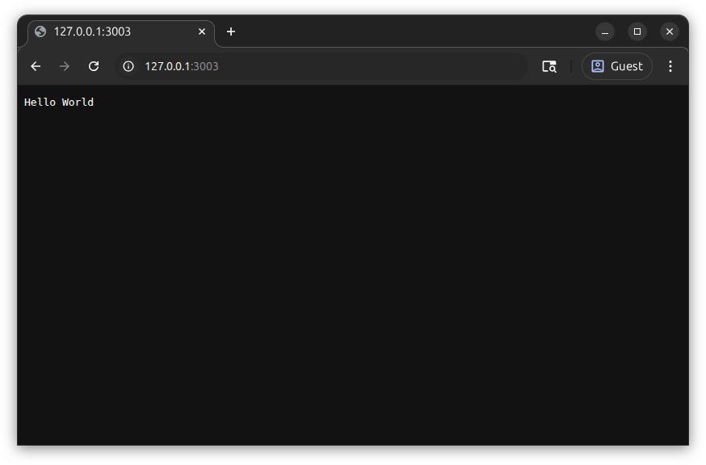
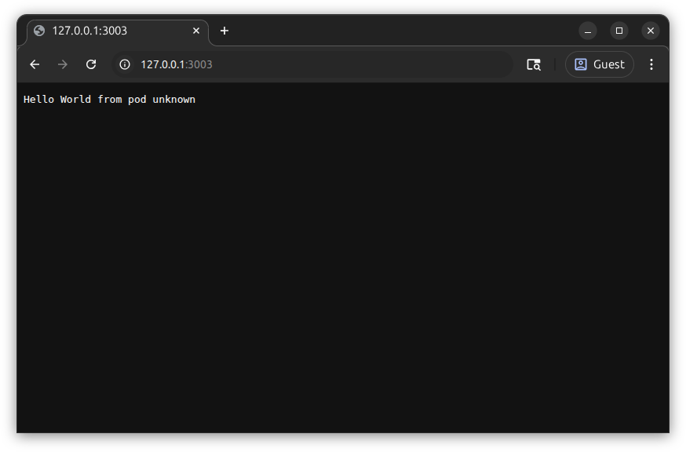
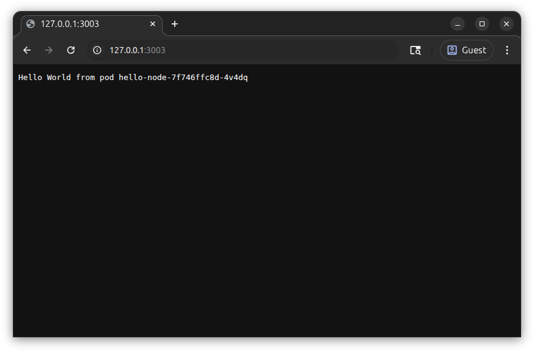

# Deployment

This tutorial builds on [Hello Kubernetes](../03-hello-kubernetes/index.md) to create kubernetes pods using a deployment and access them using a service.

## Create Cluster

Create a `kind` cluster named `tutorial` with kubernetes version `1.34.0`.
If you haven't done this before, see [Install Kind](../03-hello-kubernetes/index.md#install-kind) in the previous tutorial.

```sh
kind create cluster --name tutorial --image kindest/node:v1.34.0
```

## Create a Deployment

Next, we'll create a deployment which creates and manages multiple pods.
Each pod is similar to the one we created manually in [Create a Pod](../03-hello-kubernetes/index.md#create-a-pod).

### Create Deployment Definition

Create a new file `hello-node-deployment.yaml` and paste the following.

```yaml { title=hello-node-deployment.yaml }
--8<-- "docs/kubernetes-walkthrough/04-deployment/hello-node-deployment.yaml"
```
{ .annotate }

1. `#!yaml name` can be anything that contains only letters, numbers, and dashes.
   Kubernetes will name pods starting with the deployment name.
2. The deployment's `#!yaml metadata.labels` will make it easier for us to inspect both the deployment and its pod with a single command.
   Otherwise, they aren't related to the deployment's `#!yaml spec.selector,matchLabels` or the pod's `#!yaml spec.template.metadata.labels` below.
3. Settings `#!yaml replicas: 3` will create `3` pods.
4. The `#!yaml spec.selector` tells kubernetes how to find pods managed by the deployment.
   It should match labels defined in `#!yaml spec.template.metadata.labels`.
5. `#!yaml spec.template` defines how to create the deployment's pods.
   Notice how the deployment's `#!yaml spec.template.spec` matches the pod `#!yaml spec` in [Create Pod Definition](../03-hello-kubernetes/index.md#create-pod-definition).
6. The pod `#!yaml template`'s `#!yaml metadata.labels` should include the labels from `#!yaml spec.selector.matchLabels` above.

### Apply Deployment Definition

Apply the deployment definition to create the deployment in the cluster.

```sh
kubectl apply -f hello-node-deployment.yaml
```

```text { title=Output .no-copy }
deployment.apps/hello-node created
```

### Get Resources

Show all kubernetes resources with the label `#!yaml app: node`.

```sh
kubectl get all -l app=hello-node
```

```text { title=Output .no-copy }
NAME                              READY   STATUS    RESTARTS   AGE
pod/hello-node-749cb98bdb-hmqvd   1/1     Running   0          32s
pod/hello-node-749cb98bdb-v7jkj   1/1     Running   0          32s
pod/hello-node-749cb98bdb-z6s99   1/1     Running   0          32s

NAME                         READY   UP-TO-DATE   AVAILABLE   AGE
deployment.apps/hello-node   3/3     3            3           32s

NAME                                    DESIRED   CURRENT   READY   AGE
replicaset.apps/hello-node-749cb98bdb   3         3         3       32s
```

If the `pod`s have a `STATUS` of `ErrImageNeverPull`, see [Load Image](../03-hello-kubernetes/index.md#load-image) from [Hello Kubernetes](../03-hello-kubernetes/index.md).

Notice `3` `pod`s have `STATUS=Running`, and the `deployment` shows `READY` `3/3`.
In addition to these resource types, we also see a `replicaset`.
You can read more about how a [Replica Set](https://kubernetes.io/docs/concepts/workloads/controllers/replicaset/) works in the kubernetes documentation.
For now, it's enough to know that kubernetes uses replica sets to manage a deployment's pods.

## Show Logs

Just like we did with a single pod, we can inspect the logs for all of the pods created by the `hello-node` `deployment`.

```sh
kubectl logs -l app=hello-node --prefix
```

```text { title=Output .no-copy }
[pod/hello-node-749cb98bdb-hmqvd/app] Server running at http://0.0.0.0:3000/
[pod/hello-node-749cb98bdb-v7jkj/app] Server running at http://0.0.0.0:3000/
[pod/hello-node-749cb98bdb-z6s99/app] Server running at http://0.0.0.0:3000/
```

## Port Forwarding

`kubectl` supports forwarding a port to one of a deployment's pods.
To avoid collisions with earlier tutorials, We'll forward a different host port (`3003`) to container port `3000`.

```sh
kubectl port-forward deployment/hello-node 3003:3000
```

```text { title=Output .no-copy }
Forwarding from 127.0.0.1:3003 -> 3000
Forwarding from [::1]:3003 -> 3000
```

`kubectl port-forward` will keep running to handle connections.
Open <http://127.0.0.1:3003/> in the browser, and we can again see our **Hello World** greeting!



`kubectl port-forward` will also generate some additional output.

```text { title="Output" .no-copy }
Handling connection for 3003
```

Now that we're done testing, press ++ctrl+c++ in your terminal to stop the `kubectl port-forward`.

## Logging Pod Name

Now that we have more than one pod running, it would be nice to know which is handling the request.

### Update Code To Log Pod Name

We'll need to modify the source code of our node service to print the pod name.

``` js {: title=index.js linenums="1" hl_lines="5 10" }
--8<-- "docs/kubernetes-walkthrough/04-deployment/log-pod-name-1.0.2/index.js"
```
{ .annotate }

1. Set the javascript constant `#!js podName` to the value stored in the `#!js POD_NAME` environment variable.
   If `#!js POD_NAME` is not set, use `#!js 'unknown'`, which will happen until we reconfigure the deployment.
2. Include `#!js podName` in the response shown in the browser.
3. Include `#!js podName` in the log message printed on pod startup.

Rebuild the docker image:

```sh
docker build --tag hello-node:1.0.2 . && kind load docker-image --name tutorial hello-node:1.0.2
```

### Update Deployment Image

Modify the deployment to use the new version:

``` yaml {: title=hello-node-deployment-1.0.2.yaml linenums="1" hl_lines="19" }
--8<-- "docs/kubernetes-walkthrough/04-deployment/hello-node-deployment-1.0.2.yaml"
```
{ .annotate }

1. version updated to `1.0.2` to match the new docker image

Re-apply the deployment definition.

```sh
kubectl apply -f hello-node-deployment-1.0.2.yaml
```

```text { title=Output .no-copy }
deployment.apps/hello-node configured
```

Check the startup logs.

```sh
kubectl logs -l app=hello-node --prefix
```

```text { title=Output .no-copy }
[pod/hello-node-b84c9b567-pjcfj/app] Server running on pod unknown at http://0.0.0.0:3000/
[pod/hello-node-b84c9b567-v6pgj/app] Server running on pod unknown at http://0.0.0.0:3000/
[pod/hello-node-b84c9b567-d86sd/app] Server running on pod unknown at http://0.0.0.0:3000/
```

Forward a port to the deployment again.

```sh
kubectl port-forward deployment/hello-node 3003:3000
```

Open <http://127.0.0.1:3003/> in the browser, and we can see the **Hello World from pod unknown** greeting!



Press ++ctrl+c++ in your terminal to stop the `kubectl port-forward`.

### Update Deployment Environment

Modify the deployment to set the `POD_NAME` environment variable.

``` yaml {: title=hello-node-deployment-1.0.2-pod-name.yaml linenums="1" hl_lines="27" }
--8<-- "docs/kubernetes-walkthrough/04-deployment/hello-node-deployment-1.0.2-pod-name.yaml"
```
{ .annotate }

1. Set the `POD_NAME` environment variable to the pod's `metadata.name`
   See [Information available via `fieldRef`](https://kubernetes.io/docs/concepts/workloads/pods/downward-api/#downwardapi-fieldRef) in the kubernetes documentation.

Re-apply the deployment definition.

```sh
kubectl apply -f hello-node-deployment-1.0.2-pod-name.yaml
```

```text { title=Output .no-copy }
deployment.apps/hello-node configured
```

Check the startup logs.

```sh
kubectl logs -l app=hello-node --prefix
```

```text { title=Output .no-copy }
[pod/hello-node-7f746ffc8d-4v4dq/app] Server running on pod hello-node-7f746ffc8d-4v4dq at http://0.0.0.0:3000/
[pod/hello-node-7f746ffc8d-8xfts/app] Server running on pod hello-node-7f746ffc8d-8xfts at http://0.0.0.0:3000/
[pod/hello-node-7f746ffc8d-zjqbc/app] Server running on pod hello-node-7f746ffc8d-zjqbc at http://0.0.0.0:3000/
```

Forward a port to the deployment again.

```sh
kubectl port-forward deployment/hello-node 3003:3000
```

Open <http://127.0.0.1:3003/> in the browser, and we can see the **Hello World from pod ...** greeting!



Note that if you press refresh a few times, the message won't change because the same pod handles every request.
Because `kubectl port-forward` selects the deployment's first pod, there's no way to choose another with this method.
In the next tutorial, we'll learn how to create a `Service` which sends traffic to the pods.

Press ++ctrl+c++ in your terminal to stop the `kubectl port-forward`.
