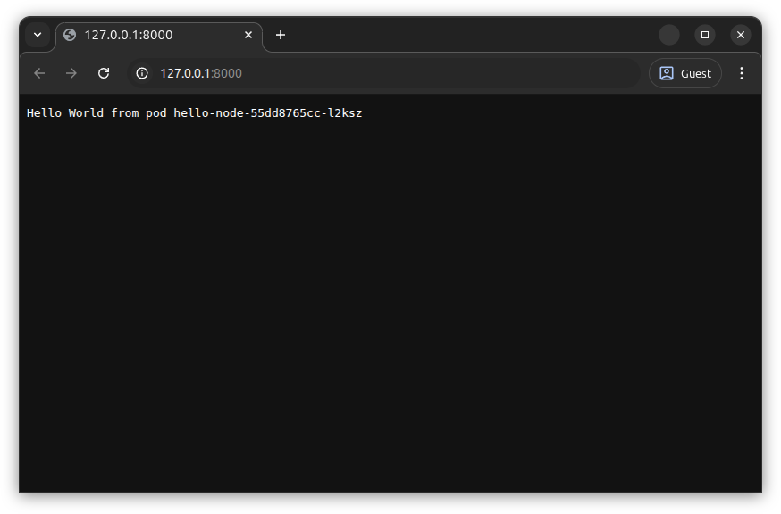

# Service

This tutorial uses a `Service` to route traffic to one of the pods created by the [Deployment](../04-deployment/index.md) last time.
It assumes that you've already created the deployment and have multiple pods running.

??? info "Quick Setup"

    Links to sections of previous lessons which are required to set up your environment.

    1. [Create cluster](../03-hello-kubernetes/index.md#create-cluster)
    2. [Build docker image](../04-deployment/index.md#update-deployment-image)
    3. [Create deployment](../04-deployment/index.md#create-a-deployment)

## Purpose

A `Deployment` creates multiple pods, each of which have their own IP address.
However, the pods have unpredictable names such as `hello-node-7f746ffc8d-4v4dq`, so it's not easy to connect to them from other applications.
A `Service` has exactly the `#!yaml metadata.name:` it specifies, and can route network traffic it receives to pods.
We'll investigate each of the service types Kubernetes supports below.

## Service Types

We're going to test out all 4 of the Kubernetes `Service` types:

- `ClusterIP`
- `NodePort`
- `ExternalName`
- `LoadBalancer`

## ClusterIP Service Type

### ClusterIP Service Definition

Create the file `hello-node-service-clusterip.yaml` and paste the contents below.

```yaml { title=hello-node-service-clusterip.yaml }
--8<-- "docs/kubernetes-walkthrough/05-service/hello-node-service-clusterip.yaml"
```

1. The name of the service can also be used to find the service's IP using the cluster's DNS.
   The DNS name `hello-node-clusterip` can be used to reach the service from other pods in the same namespace.
   Assuming the service is deployed to the `default` namespace, any of the names below can be used to reach the service from other pods in any namespace:
      - `hello-node-clusterip.default`
      - `hello-node-clusterip.default.svc`
      - `hello-node-clusterip.default.svc.cluster`
      - `hello-node-clusterip.default.svc.cluster.local`
2. The `Service`'s `#!yaml metadata.labels:` will make it easier for us to inspect all of the application's resources with a single command.
   Otherwise, they aren't related to the `Service`'s `#!yaml spec.selector:`.
3. The `selector` determines which pods should receive traffic from the service.
   Every item in the `Service`'s `#!yaml spec.selector:` must match an item in the `Pod`'s `#!yaml metadata.labels:`, or the `Deployments`'s `#!yaml spec.template.metadata.labels:` which creates the `Pod`.
   It's fine if the `Pod` has other labels which aren't mentioned in the `Service`'s selector.
4. In later sections, we'll test out other `Service` `#!yaml type:`s.
5. Other applications will connect to the `Service`'s `#!yaml port:`
6. The service will send requests to the `#!yaml targetPort:` on selected `Pod`s.
   The `Service`'s `#!yaml targetPort:` should match the `Pod`'s `#!yaml containerPort:`.

### Apply ClusterIP Service

Apply the service definition to create the service in the cluster.

```sh
kubectl apply -f hello-node-service-clusterip.yaml
```

```text { title=Output .no-copy }
service/hello-node-clusterip created
```

### Get ClusterIP Service

```sh
kubectl get service hello-node-clusterip
```

```text { title=Output .no-copy }
NAME                   TYPE        CLUSTER-IP      EXTERNAL-IP   PORT(S)   AGE
hello-node-clusterip   ClusterIP   10.96.100.181   <none>        80/TCP    67s
```

### Test ClusterIP Service

Unfortunately, a `Service` with `#!yaml spec.type: ClusterIP` has just what it sounds like, an IP address that's only valid inside the cluster.
To access the service, we need to use `kubectl port-forward` in a similar way to accessing a `Deployment` in previous chapters.

```sh
kubectl port-forward service/hello-node-clusterip 8000:80
```

!!! note

    The `port-forward` destination port changed to `80` to match the `#!yaml port: 80` in the `Service` definition.

Open <http://127.0.0.1:8000/> in the browser, and we can see the **Hello World from pod ...** greeting!



If you press refresh a few times, the message still doesn't change because the same pod handles every request.
Unfortunately, `kubectl port-forward` doesn't really send requests to the `Service`, it simply selects the
`Deployment`'s first pod.

Press ++ctrl+c++ in your terminal to stop the `kubectl port-forward`.

## NodePort Service Type

A `NodePort` service exposes a high humbered port (`30000`-`32767`) on all nodes.
This will finally allow us to access the `Service`/`Deployment` without using `kubectl port-forward`.

### NodePort Service Definition

Create the file `hello-node-service-nodeport.yaml` and paste the contents below.

```yaml { title=hello-node-service-nodeport.yaml hl_lines="4 10 14" }
--8<-- "docs/kubernetes-walkthrough/05-service/hello-node-service-nodeport.yaml"
```

1. This `#!yaml Service` uses a different name, so we can deploy it without removing the `#!yaml hello-node-clusterip` service.
2. Note the `#!yaml type:` has changed relative to the previous service.
3. If `#!yaml nodePort:` is not specified, one will be assigned automatically.
   Setting the port ourselves makes it easier to follow examples.

### Apply NodePort Service

Apply the service definition to create the service in the cluster.

```sh
kubectl apply -f hello-node-service-nodeport.yaml
```

```text { title=Output .no-copy }
service/hello-node-nodeport created
```

### Get NodePort Service

```sh
kubectl get service hello-node-nodeport
```

```text { title=Output .no-copy }
NAME                  TYPE       CLUSTER-IP      EXTERNAL-IP   PORT(S)        AGE
hello-node-nodeport   NodePort   10.96.196.195   <none>        80:30001/TCP   43s
```

### Test NodePort Service

First, we need to find the address of the kind kubernetes node, so that we can connect to it from the browser.

```sh
NODE_ADDRESS=$(kubectl get nodes --output=jsonpath='{.items[*].status.addresses[?(@.type=="InternalIP")].address}')
```

!!! tip

    The `jsonpath` expression is a bit complicated.
    If you wanted to write a similar expression, you can save the
    JSON output to a file to inspect its structure.

    ```sh
    kubectl get nodes --output=json > nodes.json
    ```

If you'd like to see the node address, you can run:

```sh
echo $NODE_ADDRESS
```

Instead of opening the address in a browser, we're going to send `10` requests quickly using `curl`.
We'll use the `NODE_ADDRESS` environment variable set above, along with the port `:30001` specified by `#!yaml nodePort:` in the [NodePort Service Definition](#nodeport-service-definition).

```sh
for x in {1..10}; do curl -s $NODE_ADDRESS:30001; done
```

This should give you output similar to the below.
Note that we can see all 3 pods handle the request.

```
Hello World from pod hello-node-7944c56f54-qsw47
Hello World from pod hello-node-7944c56f54-bxgk7
Hello World from pod hello-node-7944c56f54-qsw47
Hello World from pod hello-node-7944c56f54-qsw47
Hello World from pod hello-node-7944c56f54-bxgk7
Hello World from pod hello-node-7944c56f54-vskkf
Hello World from pod hello-node-7944c56f54-qsw47
Hello World from pod hello-node-7944c56f54-vskkf
Hello World from pod hello-node-7944c56f54-qsw47
Hello World from pod hello-node-7944c56f54-vskkf
```

We're one step closer to connecting to our application in a nice way.
However, this still isn't a very good experience since we're not able to use the standard `http://` port `80`.
